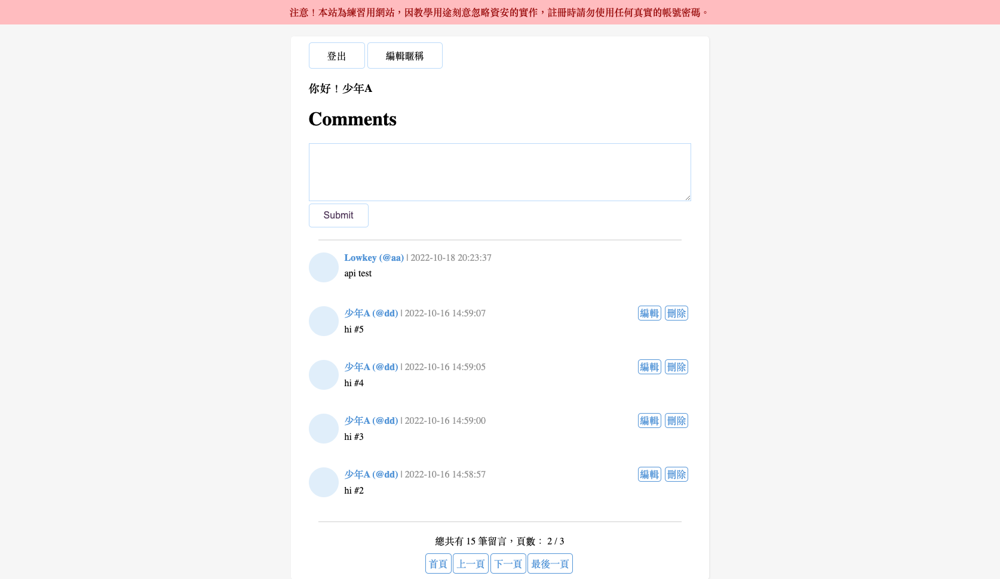

 

  

  <h3 align="center">PHP 留言板</h3>

  

    一個使用 PHP 和 MySQL 構建的簡易留言板系統。
     
     
    <a href="https://youtu.be/g_11a8o1h-Q">觀看影片示範</a>
    &middot;
    <a href="https://github.com/lazybonejc/php_bulletin_board/issues/new?labels=bug&template=bug-report---.md">回報問題</a>
  

  
目錄

  <ol>
    <li><a href="#about-the-project">關於專案</a></li>
    <li><a href="#features">主要功能</a></li>
    <li><a href="#built-with">開發技術</a></li>
  </ol>

## 關於專案

這個專案是一個功能完整的簡易留言板，允許用戶註冊、登入並在留言板上發布、編輯和刪除留言。

(<a href="#readme-top">回到頁首</a>)

## 主要功能
專案實現了以下功能：
* **用戶認證**：用戶可以註冊新帳號或登入現有帳號。
* **留言管理**：已登入用戶可以新增、編輯和刪除自己的留言。
* **API**：提供 API 接口來讀取和新增留言。
* **Bootstrap 樣式**：介面使用 Bootstrap 進行樣式設定。

(<a href="#readme-top">回到頁首</a>)

### 開發技術

這個專案使用以下技術開發：

* PHP
* MariaDB
* HTML
* CSS
* Bootstrap

發現並補強數個資安漏洞，包括：

* cookie 的偽造（Session）
* 明文密碼（Hash function）
* XSS、SQL Injection
* 權限管理

(<a href="#readme-top">回到頁首</a>)

